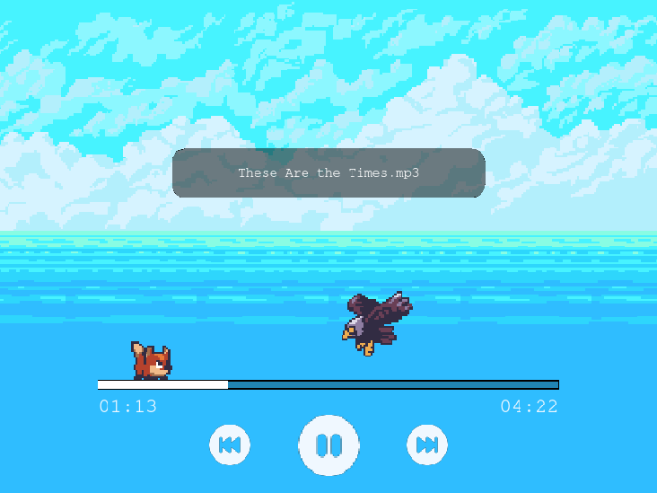

# Functionally Dysfunctional




## Project Overview

This project, titled "Functionally Dysfunctional," is a submission to the [Coding with Lewis](https://www.youtube.com/c/CodingwithLewis) Hackathon. The theme for the hackathon is to create a functional project with an unconventional twist. This entry is a unique music player where users control a character on the music progress bar. As the music plays, enemies try to knock the character off the platform. If they succeed, the music restarts from the beginning. The challenge intensifies as the enemies' speed increases with the progression of the music.

## Technologies Used

-   [**Phaser.js**](https://phaser.io/): A fast, free, and fun open-source framework for Canvas and WebGL powered browser games. Phaser.js is used to create the interactive game elements and animations.
-   [**Node.js**](https://nodejs.org/): A JavaScript runtime built on Chrome's V8 JavaScript engine. Node.js is used for the backend server to handle any necessary server-side logic and API calls.
-   [**Vite**](https://vitejs.dev/): A build tool that aims to provide a faster and leaner development experience for modern web projects. Vite is used to bootstrap the application, providing a fast and efficient development environment.

## Assets

-   **Game Sprites and Graphics**: [SunnyLand](https://ansimuz.itch.io/sunny-land-pixel-game-art)
-   **Icons**: [Bootstrap Icons](https://icons.getbootstrap.com)

## Getting Started

To get a local copy up and running, follow these simple steps.

### Prerequisites

Make sure you have Node.js installed. You can download it from [Node.js](https://nodejs.org/).

### Installation

1. **Clone the repository**:

    ```bash
    git clone https://github.com/correa-coder/functionally-dysfunctional.git
    cd functionally-dysfunctional
    ```

2. **Install dependencies**:

    ```bash
    npm install
    ```

3. **Provide audio files**

    Place your music files in `/public/assets/music`

4. **Run the development server**:

    ```bash
    npm run dev
    ```

5. Open your browser and navigate to the url shown in the terminal (usually `http://localhost:5173`) to see the application in action.

## Usage

-   **Control the Character**: Use the <kbd>W</kbd>, <kbd>A</kbd>, <kbd>S</kbd>, <kbd>D</kbd> keys to move the character along the music progress bar.
-   **Avoid Enemies**: Enemies will try to knock you off the platform. If they succeed, the music restarts from the beginning. Note: Crouching is the only way to avoid being hit.
-   **Progression**: As the music plays, the enemies' speed increases, making the game more challenging.

## License

Distributed under the MIT License. See `LICENSE` for more information.
